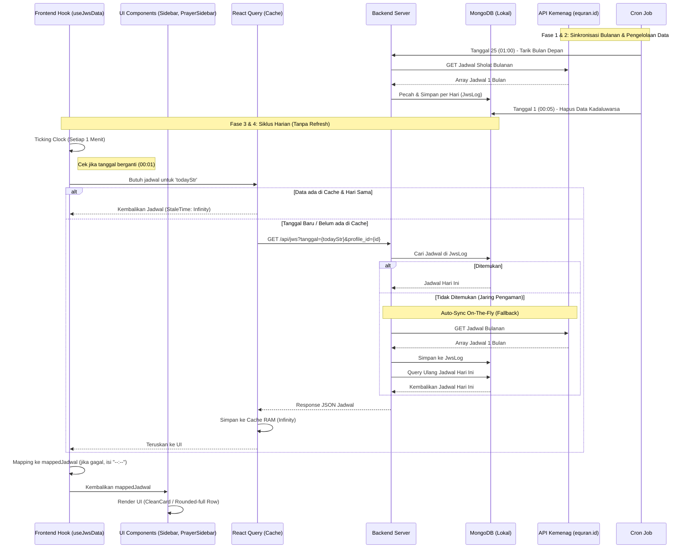

# Arsitektur & Alur Data Jadwal Waktu Sholat (JWS)

Dokumen ini menguraikan siklus hidup data (*End-to-End Data Flow*) dari sistem Jadwal Waktu Sholat (JWS) pada aplikasi *Digital Signage* / Masjid Dashboard, mulai dari hulu (API Eksternal Kemenag) hingga ke hilir (Layar TV/Monitor Pengguna).

## Diagram Alur Data (Sequence Diagram)

---

## Penjelasan Detail Tiap Fase

### Fase 1: Hulu (Backend Sinkronisasi ke API Eksternal)
Semua berawal dari server *backend* yang bertugas menjadi "pengumpul" data. Backend Anda tidak pernah menembak API Kemenag setiap hari secara sporadis, melainkan secara borongan per bulan untuk menghindari pemblokiran batas permintaan (*rate limit*).

1. **Pencarian ID Kota Eksternal:** Backend mencari ID kota/kabupaten yang sesuai dengan profil masjid aktif (misal: "Depok") melalui API pencarian kota.
2. **Tarik Data Sebulan Penuh:** Setelah ID kota ditemukan, backend memanggil *endpoint* jadwal sholat bulanan API eksternal. Hasilnya berupa struktur *array* berisi 30 atau 31 hari jadwal sholat.
3. **Penyimpanan ke Database (MongoDB):** Backend memecah array tersebut menjadi dokumen harian. Setiap tanggal disimpan sebagai satu dokumen (`JwsLog`) terpisah di MongoDB lokal dengan parameter pengidentifikasi berupa: `kabkota` dan `tanggal` dalam standar _UTC_.

### Fase 2: Pengelolaan Database Internal (Cron Job)
Data yang terus menumpuk di MongoDB akan membebani *storage* dan memperlambat waktu pencarian. Oleh karena itu, *scheduler* (`node-cron`) bekerja di balik layar:

> [!TIP]
> **Otomatisasi ini menjamin sistem aplikasi Anda bebas dari pemeliharaan (Zero-Maintenance) yang mengharuskan admin untuk menarik data bulanan.**

* **Auto-Fetch Jadwal Bulan Depan (Tiap Tgl 25):** 
  Setiap tanggal 25 pukul 01:00 dini hari, *cron job* memindai semua kota yang aktif di profil masjid, kemudian secara proaktif menembak API Kemenag untuk menarik data untuk bulan berikutnya.
* **Pembersihan Data Lama (Tiap Tgl 1):** 
  Setiap awal bulan pukul 00:05, *cron job* akan melakukan pembersihan (Pruning) dengan menghapus seluruh dokumen jadwal sholat milik bulan-bulan sebelumnya. Ini menjaga basis data tetap sangat ringan dan cepat.

### Fase 3: Hilir (Frontend Fetching ke Backend Lokal)
Aplikasi _digital signage_ yang tampil di TV mengambil datanya bukan dari API eksternal, melainkan langsung dari MongoDB *internal* dengan metode reaktif melalui **custom hook** [useJwsData](file:///home/subhan/Documents/project-website/jdm/frontend/src/hooks/useJwsData.js).

* **Ticking Clock (Penghitung Waktu Berjalan):** 
  Custom hook `useJwsData` memiliki *interval* waktu internal yang berdetak setiap **1 menit**. Interval ini bertugas memeriksa apakah jam digital melewati tengah malam (hari telah berganti).
* **Memicu Request API Lokal:** 
  Apabila tanggal berubah, *state variable* `todayStr` di dalam hook ikut berubah. _React Query_ mendeteksi mutasi ini dan dengan sendirinya (tanpa memerlukan *refresh* dari peramban) melakukan pemanggilan baru `GET /api/jws?tanggal=...` ke backend.
* **Auto-Sync Fallback (Jaring Pengaman):**
  Jika suatu ketika *cron job* bulan sebelumnya gagal mengeksekusi tarikan data (karena perbaikan server, dsb.), jadwal yang diminta oleh frontend tentu tidak akan ada di MongoDB. Pada kasus tersebut, backend dirancang untuk melakukan *Auto-Sync On-The-Fly*: backend akan otomatis berhenti sejenak, menghubungi API Kemenag, menyimpan data bulan tersebut seketika itu juga, dan akhirnya mengirim balik balasan yang berhasil ke *Frontend*. 

> [!IMPORTANT]
> **Jaring pengaman (Fallback)** ini sangat krusial karena memastikan layar TV masjid tidak akan pernah menampakkan nilai kosong sebelum backend menyelesaikan sync, melainkan akan menggunakan default `"--:--"` secara dinamis sampai data termuat!

### Fase 4: Penyimpanan Sementara & Merender Layar
Setelah _frontend_ menerima data matang dari _backend_, hal berikutnya terjadi pada level aplikasi di peramban web (*browser*):

1. **Penyimpanan Cerdas (Caching):** 
   Setelah `GET /api/jws` mengembalikan JSON, _React Query_ menyimpan hasil tersebut langsung ke dalam **Cache Memory (RAM)** menggunakan `queryKey` spesifik yang mewakili tanggal hari tersebut.
2. **StaleTime Infinity:**
   > [!TIP]
   > Parameter krusial yang menghemat 99% *bandwidth*!
   
   Karena kita telah mengonfigurasi properti `staleTime: Infinity`, _React Query_ menyadari bahwa isi jadwal sholat statis sampai 24 jam ke depan. Akibatnya, _React Query_ meredam/memblokir seluruh percobaan request lain ke backend yang menggunakan parameter tanggal yang sama. 
3. **Translasi & Rendering UI:** 
   Translasi dari properti flat backend (`subuh`, `dzuhur`, `ashar`, dll) menjadi array objek jadwal sholat dipusatkan di dalam custom hook `useJwsData` menghasilkan array `mappedJadwal`.
   * **Fallback Terpusat:** Jika data jadwal tidak bisa didapatkan atau sedang terjadi masalah koneksi ke backend, hook secara otomatis memetakan waktu sholat ke string `"--:--"` sehingga UI tidak menampilkan jadwal hardcoded default dan tidak menampilkan layar kosong.
   * **UI Render Bersih:** Komponen [Sidebar.jsx](file:///home/subhan/Documents/project-website/jdm/frontend/src/components/layout/Sidebar.jsx) dan [PrayerSidebar.jsx](file:///home/subhan/Documents/project-website/jdm/frontend/src/components/layout/PrayerSidebar.jsx) hanya bertindak sebagai komponen presentasional murni yang melalukan map terhadap data `mappedJadwal` dan merendernya.
